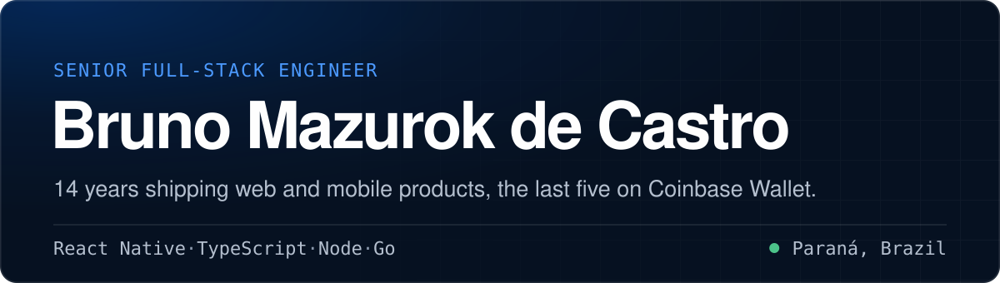
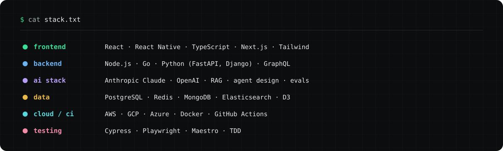
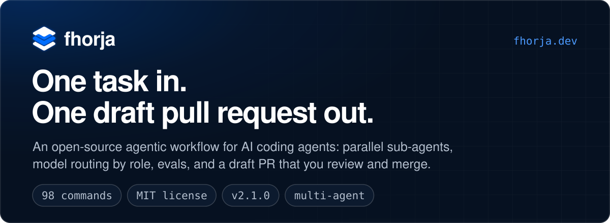
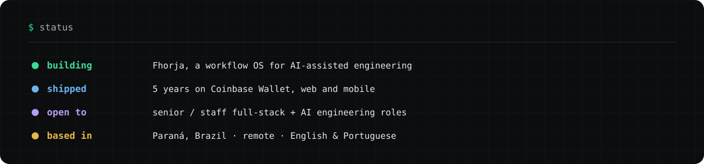

 

---

## About

Senior full-stack engineer with 14 years of experience shipping web and mobile products. I spent the last five years on **Coinbase Wallet** (web and mobile), building crypto purchase flows that move real money for non-technical people. That work put clarity, trust, and visual polish above everything else.

I work across the stack: React, React Native, TypeScript, and Next.js on the front, Node.js, Go, and Python on the back. Lately I build with the modern AI stack too, Anthropic Claude and OpenAI, RAG, agent design, evals, and LLM observability.

- Based in Paraná, Brazil. Portuguese (native), English (fluent).
- I care about technical writing and decision documentation, framing trade-offs so non-engineers can weigh in.
- Comfortable owning a feature end to end, from design-system components to backend services.

---

## Stack

---

## Featured work

**[Fhorja](https://fhorja.dev)** is a workflow operating system for AI-assisted engineering that I design and build. It gives an AI agent explicit routing, durable task memory, and closure guarantees, so the agent proposes the work and the system owns the state. Markdown, bash, and a small Python helper. Spec-driven, with a curated command set and a bug-class library. Built and dogfooded solo, heading toward an AGPL-3.0 public release.

## Status

React · React Native · TypeScript · Node · Go · Python · the AI stack

